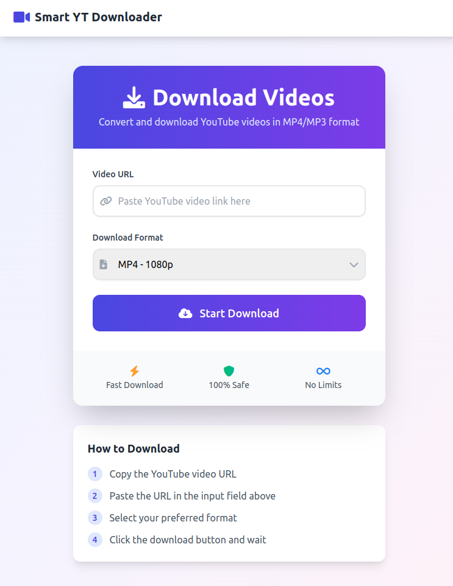

# Smart YouTube Downloader 🎥

A modern, user-friendly YouTube video downloader with a sleek UI built using PHP, JavaScript, and Tailwind CSS. Download YouTube videos in various formats (MP4/MP3) with different quality options.

![Project Demo][demo]



## ✨ Features

* 📱 Responsive, modern UI design
* 🎥 Support for multiple video formats (MP4 720p/1080p)
* 🎵 Audio extraction (MP3 192kbps/320kbps)
* ⚡ Fast download speeds
* 📊 Real-time progress tracking
* 🛡️ Error handling and validation
* 🧹 Automatic cleanup of old downloads


## 🔧 Prerequisites

* PHP >= 7.4
* Composer
* youtube-dl
* ffmpeg (for audio conversion)
* Web server (Apache/Nginx)

## 📦 Installation

1. Clone the repository:
   ```bash
   git clone https://github.com/jk08y/smart-yt-downloader.git
   cd smart-yt-downloader
   ```

2. Install PHP dependencies:
   ```bash
   composer install
   ```

3. Install youtube-dl:
   ```bash
   # On Ubuntu/Debian
   sudo apt update
   sudo apt install youtube-dl

   # On MacOS
   brew install youtube-dl

   # On Windows (using Chocolatey)
   choco install youtube-dl
   ```

4. Install ffmpeg:
   ```bash
   # On Ubuntu/Debian
   sudo apt install ffmpeg

   # On MacOS
   brew install ffmpeg

   # On Windows (using Chocolatey)
   choco install ffmpeg
   ```

5. Set up directory permissions:
   ```bash
   chmod 755 downloads/
   chmod 755 downloads/temp/
   ```

6. Configure your web server to point to the project directory.

## ⚙️ Configuration

1. Modify `php/config.php` to adjust settings if needed:
   ```php
   // Maximum file lifetime before cleanup
   define('FILE_LIFETIME', 3600); // 1 hour in seconds

   // Memory limit
   ini_set('memory_limit', '512M');
   ```

2. Ensure the following directories exist and are writable:
   ```
   /downloads
   /downloads/temp
   ```

## 🚀 Usage

1. Access the application through your web browser
2. Paste a YouTube URL into the input field
3. Select your desired format and quality
4. Click "Start Download" and wait for the process to complete
5. The file will automatically download once ready

## 💻 Development

To modify the UI or add features:

1. CSS modifications can be made in `css/style.css`
2. JavaScript logic is in `js/script.js`
3. PHP backend code is in the `php/` directory

## 🔐 Security Considerations

* The application implements file cleanup to prevent storage issues
* Input validation is performed on both client and server side
* Downloaded files are stored with sanitized filenames
* Temporary files are automatically removed

## 🤝 Contributing

1. Fork the repository
2. Create a new branch (`git checkout -b feature/improvement`)
3. Commit your changes (`git commit -am 'Add new feature'`)
4. Push to the branch (`git push origin feature/improvement`)
5. Create a Pull Request

## 📝 License

This project is licensed under the MIT License - see the [LICENSE](LICENSE) file for details.

## 🙏 Acknowledgments

* [youtube-dl](https://youtube-dl.org/) for the core downloading functionality
* [Tailwind CSS](https://tailwindcss.com/) for the UI framework
* [Font Awesome](https://fontawesome.com/) for the icons

## ⚠️ Disclaimer

This tool is for educational purposes only. Please respect YouTube's terms of service and content creators' rights when using this application.

## 📞 Support

If you encounter any issues or have questions, please [open an issue](https://github.com/yourusername/smart-youtube-downloader/issues).

<!-- Link References -->
[youtube-dl]: https://youtube-dl.org/
[tailwind]: https://tailwindcss.com/
[fontawesome]: https://fontawesome.com/


